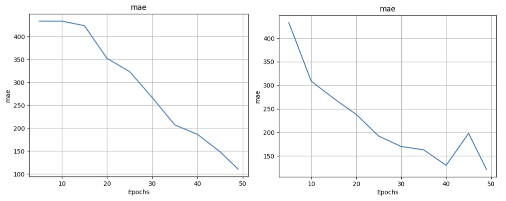
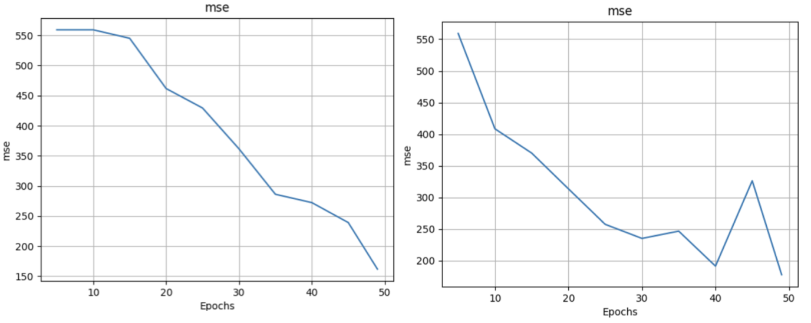

# 🧠 Adaptive Region-aware P2R Loss for Crowd Counting

This project was conducted as part of a competition organized by the YAI Conference (October 2025 – December 2025).
We aim to improve upon the limitations of the original P2R (Point-to-Region) Loss and build a more robust and precise crowd counting framework.
This project introduces two major enhancements to the P2R Loss formulation.

---

## 🚀 Methods

### 1. Adaptive Region Radius
The original P2R Loss uses a fixed region radius for all ground-truth points, which does not reflect varying crowd densities.
In this project, we dynamically adjust the radius using the nearest-neighbor distance between GT points, so that:

- Dense regions → smaller radius
- Sparse regions → larger radius

---

### 2. Distance-aware Weighting
Anchors closer to the GT center are treated as stronger positives, while farther anchors receive weaker weights.
We generalize the distance-weighting formulation to support multiple kernels:

- Linear kernel  
- Gaussian kernel  
- Exponential kernel  

General form:

$w' = w \times (1 + \alpha \cdot f(d))$ , where f is kernel function

---

## 📊 Dataset: ShanghaiTech Part A & B

Download Link : (To be added)

This project uses the dataset in the following structure:

    ShanghaiTech/part_A/train_data/images/IMG_1.jpg
    ShanghaiTech/part_A/train_data/new-anno/GT_IMG_1.npy
    ShanghaiTech/part_B/test_data/images/IMG_1.jpg

---

## ⚙️ Execution

### run.sh
    datadir=/<path>/ShanghaiTech/part_A

### Training
    bash run.sh

### Evaluation
    python test.py --root <path> --part <A or B>

---

## 📈 Results

### 1. Increase the convergence speed

   
  <em>[MAE] Left: base model, Right: best model</em>

   
  <em>[MSE] Left: base model, Right: best model</em>

### 2. Improved test performance

| Model        | Part | MAE     | MSE (RMSE) |
|--------------|------|---------|------------|
| **Base**     | A    | 108.929 | 193.993    |
| **Base**     | B    | 38.506  | 59.841     |
| **Best (Ours)** | A    | **101.143** | **183.334** |
| **Best (Ours)** | B    | **28.699**  | **48.502**  |

---

## 📝 Reference
Point-to-Region (P2R) Loss for Crowd Counting, CVPR
